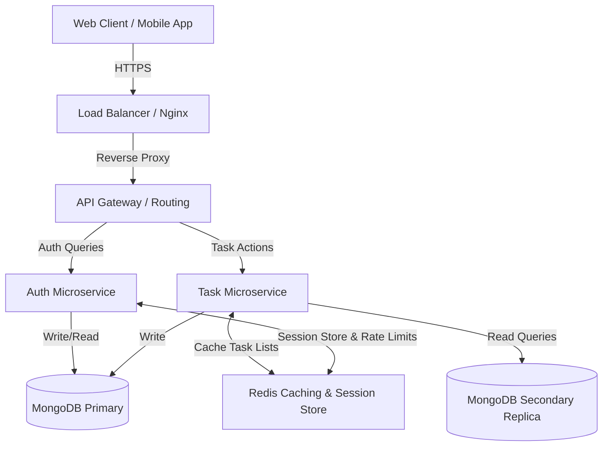

# Secure Task Management System (MERN Stack)

A secure, production-grade MERN (MongoDB, Express, React, Node.js) stack Task Management application featuring role-based access control, JWT-in-cookie authentication, rate limiting, and an admin analytics dashboard.

---

## 🚀 Key Features

### Backend (Express & MongoDB)
- **Authentication**: Secure registration and login using JWT session cookies and `bcryptjs` password hashing (complexity factor: 12).
- **Role-Based Access Control (RBAC)**: Clear delineation between Standard `user` (manages own tasks) and `admin` (manages all system tasks, monitors user metrics, and views auditing aggregations).
- **API Versioning**: Standardized routing prefix under `/api/v1/`.
- **API Documentation**: Interactive Swagger documentation rendered dynamically at `/api-docs`.
- **Input Validation**: Clean body validation and HTML sanitization using `express-validator` to prevent SQL/NoSQL injections and Cross-Site Scripting (XSS).
- **Global Error Handling**: Centralized Express error handler mapping operational database exceptions (CastError, DuplicateKey, ValidationError) into structured JSON responses.

### Frontend (React & Vanilla CSS)
- **Glassmorphic Aesthetic**: Deep dark theme featuring vibrant hues, backdrop blur filters, glowing input focus borders, and hover-triggered micro-animations.
- **Silent Authentication**: Direct handshake on boot using HTTP-only cookies to verify session legitimacy.
- **Task Workspace**: Dynamic task search, status filter toggles, priority filter toggles, creation forms, and update panels.
- **Admin Stats Panel**: Dashboard for administrators displaying system-wide user counts, task completion percentages, and user workload distributions.
- **Toasts Notification Manager**: In-app feedback popups tracking success/error returns from api payloads.

---

## 🛡️ Security Implementations

1. **HttpOnly & SameSite Cookies**:
   JWT tokens are stored inside browser-invisible cookies (`httpOnly: true`) configured with `sameSite: 'lax'` to prevent XSS-based local storage tokens theft, while protecting against CSRF.
2. **Helmet Security Headers**:
   Integrates Helmet middleware to restrict malicious cross-origin scripts, clickjacking, and MIME type sniffing.
3. **Data Sanitization**:
   Employs `express-mongo-sanitize` to recursively scrub request bodies and parameters, blocking MongoDB operator injection attacks (e.g. `{"$gt": ""}`).
4. **Rate Limiting**:
   Throttles standard API requests to 150 hits per 15 minutes, and applies tighter boundaries (20 requests per 15 minutes) on authentication routes to stop brute force attempts.
5. **JSON Payload Limits**:
   Express parsers restrict incoming request payloads to a maximum of 10KB to mitigate large body Denial of Service (DoS) attacks.

---

## 📝 Scalability & Architecture Note

To prepare this application for high-traffic enterprise scaling, the following system modifications are recommended:



### 1. Transition to Microservices
- **Authentication Service**: Isolate user onboarding, credentials verification, password hashing, and token issuance to a dedicated, stateless Authentication service.
- **Task Management Service**: Run task-related CRUD operations inside an independent task management service. Communications between services can be managed via lightweight REST APIs, gRPC, or an asynchronous event broker (e.g., Apache Kafka / RabbitMQ).

### 2. Caching Layer (Redis)
- **Database Caching**: Store highly repetitive database reads (like the Admin Analytics stats or user task grids) in a Redis cache with a Time-To-Live (TTL) expiration. This minimizes database queries.
- **Rate Limit Distribution**: Migrate the memory-bound API rate limit counters to a centralized Redis storage, ensuring rate limiting functions consistently across multiple horizontal instances.

### 3. Load Balancing & Horizontal Scale
- Deploy the Express server instances within Docker containers orchestrated by **Kubernetes (K8s)** or **ECS**.
- Implement an **Nginx** or **HAProxy** reverse proxy layer configured for round-robin load distribution. Because authentication is handled via JWT tokens (stateless), any server node in the cluster can handle any incoming request.

### 4. Database Replication & Partitioning
- **Read/Write Splitting**: Set up a MongoDB Replica Set. Direct all writes to the Primary replica node, and route search/read queries to Secondary replica nodes.
- **Sharding**: shard the MongoDB `tasks` collection based on a composite key like `{ user: 1, status: 1 }` to distribute task data evenly across distinct database servers.

---

## ⚙️ Setup & Execution

### Option A: Complete Docker Deployment (Recommended)
Ensure Docker is installed and running on your system. Run this single command from the project root directory:

```bash
docker-compose up --build
```
- **React Frontend**: Served at [http://localhost:5173](http://localhost:5173)
- **Express Backend**: Served at [http://localhost:5000](http://localhost:5000)
- **API Documentation**: Served at [http://localhost:5000/api-docs/](http://localhost:5000/api-docs/)

---

### Option B: Local Manual Setup

#### Prerequisites
- Node.js (v18+)
- MongoDB running locally on port 27017 (e.g. `mongodb://localhost:27017/task_db`)

#### 1. Setup Backend
1. Open a terminal and navigate to the backend directory:
   ```bash
   cd backend
   ```
2. Install dependencies:
   ```bash
   npm install
   ```
3. Initialize configuration:
   Create a `.env` file from the example:
   ```bash
   cp .env.example .env
   ```
4. Start the backend dev server:
   ```bash
   npm run dev
   ```
   *The backend will boot on port 5000. Verification endpoint: [http://localhost:5000/]*

#### 2. Setup Frontend
1. Open a new terminal and navigate to the frontend directory:
   ```bash
   cd frontend
   ```
2. Install dependencies:
   ```bash
   npm install
   ```
3. Start the Vite React development server:
   ```bash
   npm run dev
   ```
   *The development app will launch on [http://localhost:5173/]. All calls to `/api/*` will be proxied automatically to port 5000.*
